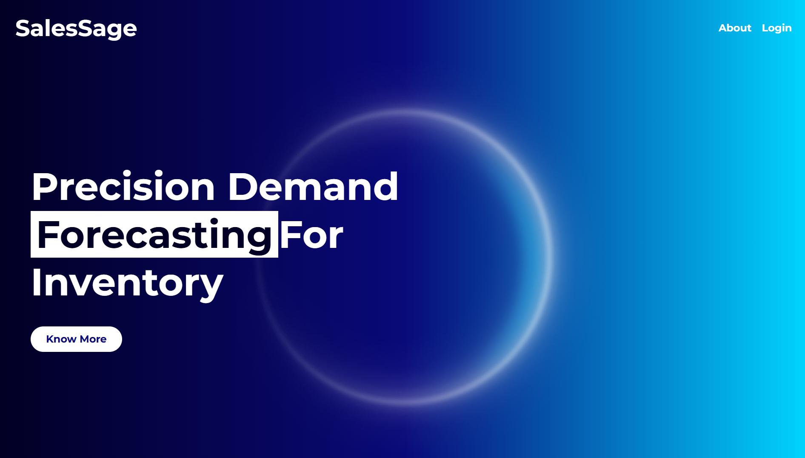

# SalesSage

# 


SalesSage is a powerful platform for predicting sales data on a daily, weekly, or yearly basis. It provides insightful analytics to help companies make data-driven decisions. The platform offers three subscription plans: one free and two paid options, tailored to different business needs.

## Table of Contents

- [Features](#features)
- [Screenshots](#screenshots)
- [Installation](#installation)
- [Usage](#usage)
- [API Documentation](#api-documentation)
- [Contributing](#contributing)
- [Roadmap](#roadmap)
- [Support](#support)
- [Authors](#authors)
- [License](#license)

## Features

- **Predictive Analytics**: Forecast sales data with high accuracy.
- **Customizable Plans**: Choose from free and paid subscription plans.
- **User-Friendly Interface**: Easy to navigate and use.
- **Real-Time Insights**: Get up-to-date sales predictions.
- **Scalable Architecture**: Easily scale the platform as your data grows.
- **Secure Data Handling**: Ensure your data is safe with our secure backend.

## Screenshots

Here are some screenshots of the SalesSage platform:

*SalesSage landing page*

<!-- 
*Dashboard displaying sales predictions.*


*Detailed sales reports.* -->

## Installation

Follow these steps to set up the project locally.

### Prerequisites

- Docker
- Docker Compose

### Clone the Repository

```bash
git clone https://github.com/pallav46/SalesSage.git
cd SalesSage
```

### Setup and Run

#### Environment Variables

The project uses environment variables for configuration. Create a `.env` file in the `backend` directory with the following variables:

```env
MONGODB_HOST=<your_mongodb_host>
MONGODB_PORT=<your_mongodb_port>
MONGODB_NAME=<your_database_name>
MONGODB_USER=<your_mongodb_username>
MONGODB_PASSWORD=<your_mongodb_password>

SECRET_KEY=<your_django_secret_key>
JWT_ALGORITHM=<your_jwt_algorithm>

EMAIL_PORT=<your_email_port>
EMAIL_HOST_USER=<your_email_host_user>
EMAIL_HOST_PASSWORD=<your_email_host_password>

RAZORPAY_KEY_ID=<your_razorpay_key_id>
RAZORPAY_KEY_SECRET=<your_razorpay_key_secret>
RAZORPAY_WEBHOOK_SECRET=<your_razorpay_webhook_secret>
```

#### Backend

1. Navigate to the `backend` directory:
    ```bash
    cd backend
    ```

2. Create and activate the virtual environment:
    ```bash
    python -m venv venv
    source venv/bin/activate  # On Windows use `venv\Scripts\activate`
    ```

3. Install dependencies:
    ```bash
    pip install -r requirements.txt
    ```

4. Run the Django server:
    ```bash
    daphne SalesSage.asgi:application
    ```

#### Frontend

1. Navigate to the `frontend` directory:
    ```bash
    cd frontend
    ```

2. Install dependencies:
    ```bash
    npm install
    ```

3. Start the development server:
    ```bash
    npm run dev
    ```

### Docker

Alternatively, you can use Docker to run both the backend and frontend.

1. Build and start the containers:
    ```bash
    docker-compose up --build
    ```

2. Access the application at `http://localhost:5173`.

## Usage

- **Accessing the Application**: Open your browser and go to `http://localhost:5173`.
- **User Registration**: Sign up for a free or paid plan.
- **Sales Predictions**: Add Sales report to view sales predictions.

## API Documentation

Our API allows developers to integrate SalesSage's predictive analytics into their own applications. Below is a brief overview of the available endpoints.

### Endpoints

- `GET /api/predictions`: Retrieve sales predictions.
- `POST /api/sales-data`: Submit sales data for analysis.

For detailed API documentation, please refer to the [API Docs](docs/api.md).

## Contributing

We welcome contributions from the community. To get started:

1. Fork the repository.
2. Create a new branch (`git checkout -b feature-branch`).
3. Make your changes.
4. Commit your changes (`git commit -m 'Add some feature'`).
5. Push to the branch (`git push origin feature-branch`).
6. Open a pull request.

Please make sure to update tests as appropriate.

### Development Environment Setup

1. **Clone the repository**:
    ```bash
    git clone https://github.com/pallav46/SalesSage.git
    cd SalesSage
    ```

2. **Backend**:
    - Create and activate a virtual environment:
        ```bash
        python -m venv venv
        source venv/bin/activate  # On Windows use `venv\Scripts\activate`
        ```
    - Install the required packages:
        ```bash
        pip install -r requirements.txt
        ```

3. **Frontend**:
    - Navigate to the `frontend` directory and install dependencies:
        ```bash
        cd frontend
        npm install
        ```

### Code Style

- Ensure your code adheres to the existing style conventions.
- Run linters before committing your code.

## Roadmap

- [ ] Add more detailed sales analytics
- [ ] Implement user authentication and authorization
- [ ] Integrate more data sources for comprehensive predictions
- [ ] Enhance the UI/UX for better user experience
- [ ] Mobile app version for on-the-go access

## Support

For support, please open an issue in the repository or contact us at support@SalesSage.com.

## Authors

- **Ishaan** - *Backend* - [ishaan19d](https://github.com/ishaan19d)
- **Ubaid** - *AI & ML* - [ubaid2751](https://github.com/ubaid2751)
- **Pallav** - *Frontend* - [pallav46](https://github.com/pallav46)

See also the list of [contributors](https://github.com/pallav46/SalesSage/contributors) who participated in this project.

## License

This project is licensed under the MIT License. See the [LICENSE](LICENSE) file for details.
